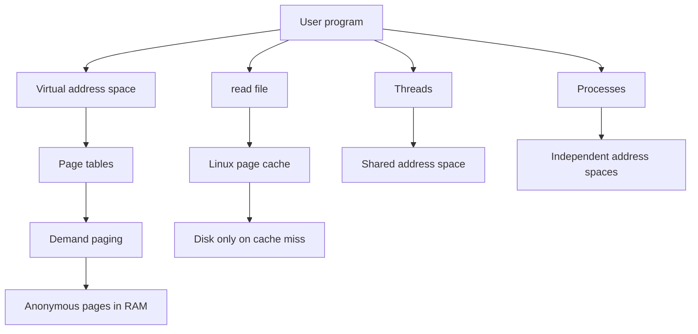

# Visualizing the End Result

These labs are meant to make the following Linux memory model visible and testable.

## Mental model

- `mmap()` usually reserves address space first
- first touch can trigger page faults
- writes to anonymous pages allocate real physical memory
- repeated file reads often become faster because of page cache
- threads usually share one address space
- separate processes usually do not share an address space, but can still benefit from shared kernel page cache
